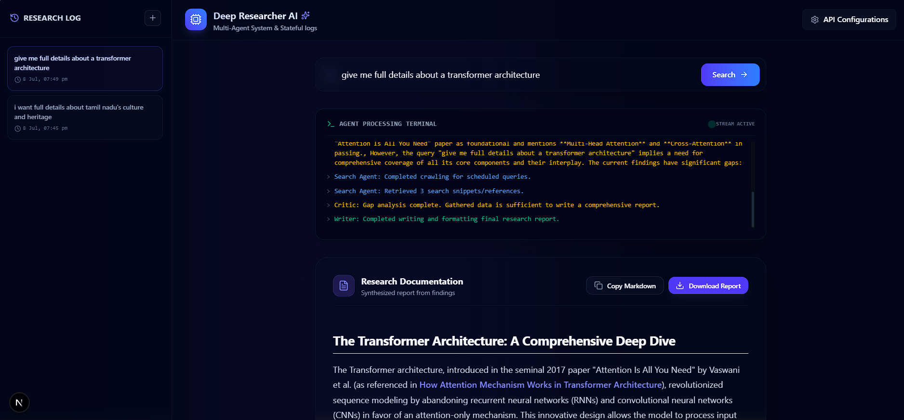

# Deep Researcher AI - Multi-Agent Research System

Deep Researcher AI is a production-grade, stateful AI research assistant. Powered by a **Plan-and-Execute multi-agent workflow** orchestrated with **LangGraph**, it generates comprehensive, structured markdown reports on any given topic using **Google Gemini 3.5 Flash** and real-time internet indexing from the **Tavily Search API**.

The application features a modern, high-performance **Next.js App Router (React)** frontend that communicates with a **FastAPI** backend to stream real-time execution logs via Server-Sent Events (SSE).

---

## Project Showcase



---

## Key Features

* **Stateful Multi-Agent Orchestration (LangGraph)**:
  * **Planner**: Analyzes the query, designs a structured research checklist, and schedules the initial web searches.
  * **Search Agent**: Batches and executes targeted search requests asynchronously.
  * **Critic (Gap Analyst)**: Dynamically checks search findings against the plan, identifying missing statistics or data, and schedules up to 2 verification search iterations.
  * **Writer**: Consolidates all web research context and synthesizes a detailed Markdown report.
* **Server-Sent Events (SSE) Stream**: The backend streams live execution status messages (e.g. Node transitions and search stats) directly to a real-time console log in the frontend.
* **Persistent Session History**: Integrated with an SQLite database to store research sessions. Users can browse past reports and load them instantly from the history sidebar.
* **LaTeX Equations Rendering**: Automatically parses and beautifully formats complex mathematical formulas and science symbols (e.g. `$\sqrt{A}$`, `$\cos(x)$`) using KaTeX.
* **API Configurations**: Keys are stored securely in local storage, eliminating the need to set up local environment variables for quick runs.

---

##Technology Stack

* **Frontend**: Next.js (App Router), React, Tailwind CSS, Lucide Icons, ReactMarkdown, KaTeX.
* **Backend**: FastAPI (Python), Uvicorn.
* **AI & Search Agents**: LangGraph, LangChain Core, `langchain-google-genai` (Gemini 2.5 Flash), Tavily Search SDK.
* **Database**: SQLite3.

---

## Getting Started & Local Installation

### Prerequisites
* Python 3.10+
* Node.js v18+ & npm

### 1. Setup Backend
1. Open your terminal in the backend project directory:
   ```bash
   cd my-deep-researcher
   ```
2. Initialize and activate a virtual environment:
   ```bash
   python -m venv .venv
   # Windows PowerShell
   .venv\Scripts\Activate.ps1
   # Linux/macOS
   source .venv/bin/activate
   ```
3. Install the dependencies:
   ```bash
   pip install -r requirements.txt
   ```
4. Start the FastAPI server (runs on `http://localhost:8000`):
   ```bash
   uvicorn backend:app --reload
   ```

### 2. Setup Frontend
1. Open a new terminal in the frontend directory:
   ```bash
   cd my-deep-researcher/frontend
   ```
2. Install npm packages:
   ```bash
   npm install
   ```
3. Start the Next.js development server (runs on `http://localhost:3000`):
   ```bash
   npm run dev
   ```
4. Open **`http://localhost:3000`** in your browser, enter your API keys, and run a query!

---

